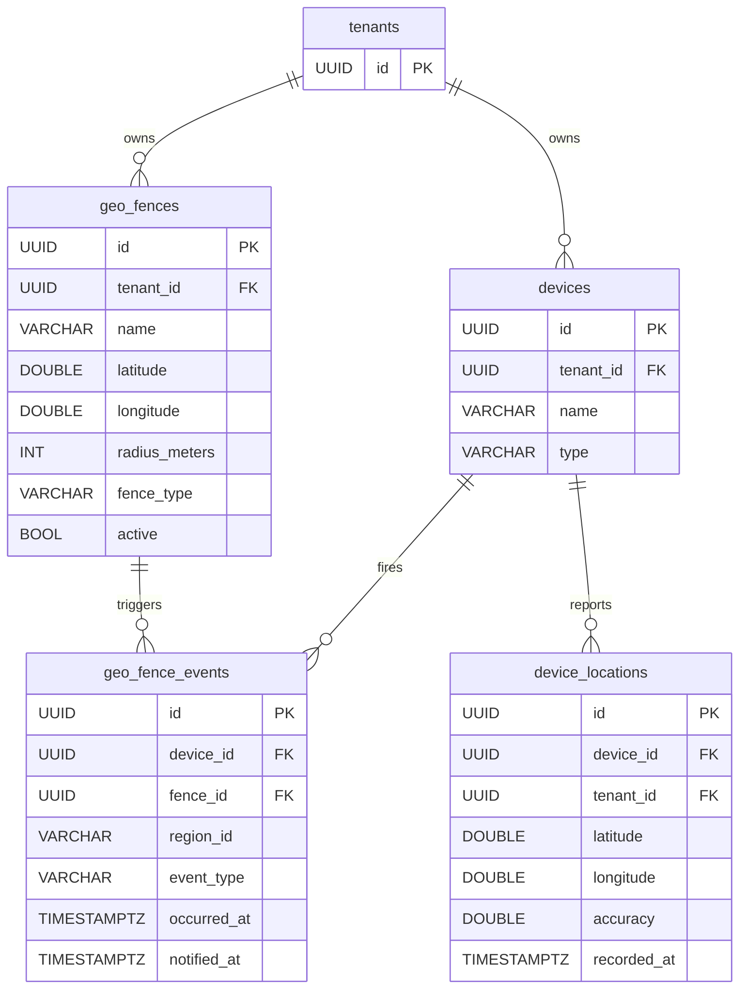
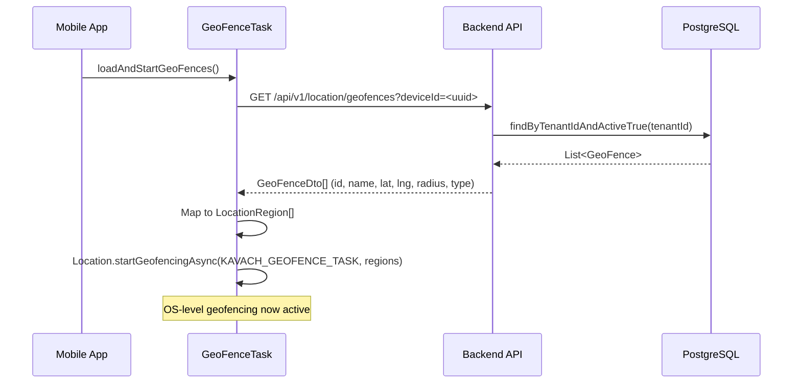
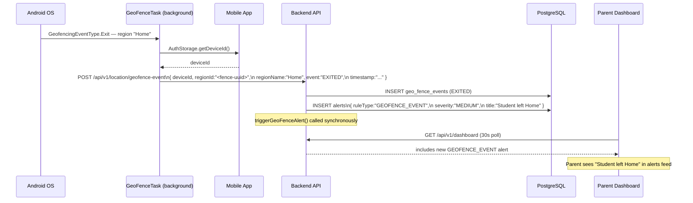
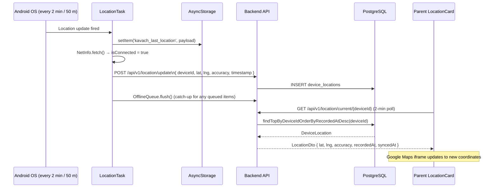
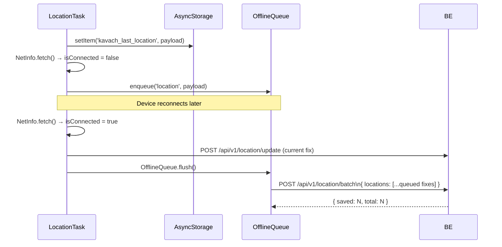

# Geofencing Feature — End-to-End Technical Reference

> **KAVACH AI · Monorepo · March 2026**  
> Covers: Mobile (Expo/React Native) · Backend (Spring Boot 3) · Web App (Next.js 14)

---

## Table of Contents

1. [Feature Overview](#1-feature-overview)
2. [Architecture Diagram](#2-architecture-diagram)
3. [Database Schema](#3-database-schema)
4. [API Reference](#4-api-reference)
5. [Mobile Implementation](#5-mobile-implementation)
6. [Backend Implementation](#6-backend-implementation)
7. [Web App (Parent Dashboard)](#7-web-app-parent-dashboard)
8. [End-to-End Flow Walkthroughs](#8-end-to-end-flow-walkthroughs)
9. [Fence Types & Alert Logic](#9-fence-types--alert-logic)
10. [Offline Behaviour](#10-offline-behaviour)
11. [Permissions & Security](#11-permissions--security)
12. [File Map](#12-file-map)

---

## 1. Feature Overview

Geofencing allows a parent to define **named geographic zones** around real-world locations (home, school, coaching centre, etc.). The student's Android phone monitors these zones in the background and fires enter/exit events to the backend the moment a boundary is crossed. The parent receives an instant alert on their dashboard.

### Two fence types

| Type    | Trigger         | Use case                                        |
|---------|-----------------|--------------------------------------------------|
| `SAFE`  | Child **exits** | Home or school — "Is my child still there?"     |
| `ALERT` | Child **enters** | Banned locations — "Did my child go to the mall?" |

### What is also tracked alongside geofencing

Geofencing is part of the broader **location subsystem** which includes:

- **Continuous GPS tracking** — background location updates every 2 minutes or 50 metres, stored in `device_locations` and displayed as a live map on the parent dashboard.
- **Geo-fence monitoring** — circle-based zone watch using the OS-level geofencing API.
- **Offline queue** — location fixes and batch uploads are queued and flushed on reconnect.

---

## 2. Architecture Diagram

```mermaid
graph TD
    subgraph Mobile ["Mobile App (Android — Expo 51)"]
        LT[LocationTask\nKAVACH_LOCATION_TASK\n2 min / 50 m GPS fixes]
        GFT[GeoFenceTask\nKAVACH_GEOFENCE_TASK\nOS-level region monitor]
        OQ[OfflineQueue\nAsyncStorage buffer]
        AS[AsyncStorage\nLast-known location]
    end

    subgraph Backend ["Backend API (Spring Boot 3)"]
        LC[LocationController]
        LS[LocationService]
        AES[AlertEvaluationService]
        SSE[SseRegistry\nReal-time push to parent]
        DB[(PostgreSQL)]
    end

    subgraph WebApp ["Web App (Next.js 14)"]
        DP[/parent/devices/\nDevicesPage]
        LoC[LocationCard\nGoogle Maps embed\n2-min polling]
    end

    %% App-open: fetch fences
    GFT -- "GET /api/v1/location/geofences?deviceId" --> LC
    LC --> LS
    LS -- "findByTenantIdAndActiveTrue()" --> DB
    DB -- "List<GeoFenceDto>" --> LS
    LS --> LC
    LC -- "GeoFence[]" --> GFT
    GFT -- "Location.startGeofencingAsync(regions)" --> GFT

    %% GPS fix path
    LT -- "online: POST /location/update" --> LC
    LT -- "offline: enqueue" --> OQ
    OQ -- "POST /location/batch on reconnect" --> LC
    LT -- "always: setItem(last_location)" --> AS
    LC --> LS
    LS -- "save DeviceLocation" --> DB

    %% Fence event path
    GFT -- "POST /location/geofence-event" --> LC
    LC --> LS
    LS -- "save GeoFenceEvent" --> DB
    LS -- "triggerGeoFenceAlert()" --> AES
    AES -- "save Alert" --> DB

    %% Parent reads
    LoC -- "GET /location/current/{deviceId} (JWT)" --> LC
    LC --> LS
    LS -- "findTopByDeviceIdOrderByRecordedAtDesc()" --> DB
    DB --> LoC
```

---

## 3. Database Schema

Schema is introduced by **migration `V21__location_geofences.sql`**.

### `geo_fences`

Stores the zones created by the parent/admin for a tenant.

| Column          | Type             | Notes                                  |
|-----------------|------------------|----------------------------------------|
| `id`            | `UUID` PK        | `gen_random_uuid()`                    |
| `tenant_id`     | `UUID` FK        | → `tenants(id)` ON DELETE CASCADE      |
| `name`          | `VARCHAR(100)`   | Human label: "Home", "School"          |
| `latitude`      | `DOUBLE PRECISION` | Centre of the circle                 |
| `longitude`     | `DOUBLE PRECISION` | Centre of the circle                 |
| `radius_meters` | `INTEGER`        | Default **200 m**                      |
| `fence_type`    | `VARCHAR(20)`    | `SAFE` \| `ALERT`                      |
| `active`        | `BOOLEAN`        | Default `TRUE` — soft-delete via flag  |
| `created_at`    | `TIMESTAMPTZ`    | Auto-set                               |

**Index:** `idx_geofence_tenant` — on `(tenant_id) WHERE active = TRUE`

---

### `geo_fence_events`

Immutable audit log of every enter/exit crossing.

| Column        | Type           | Notes                                         |
|---------------|----------------|-----------------------------------------------|
| `id`          | `UUID` PK      |                                               |
| `device_id`   | `UUID` FK      | → `devices(id)` ON DELETE CASCADE             |
| `fence_id`    | `UUID` FK      | → `geo_fences(id)` ON DELETE SET NULL (nullable) |
| `region_id`   | `VARCHAR(100)` | Raw string sent from mobile (= fence UUID)    |
| `event_type`  | `VARCHAR(10)`  | `ENTERED` \| `EXITED`                         |
| `occurred_at` | `TIMESTAMPTZ`  | When the crossing happened on-device          |
| `notified_at` | `TIMESTAMPTZ`  | Nullable — reserved for future email/SMS hook |

**Index:** `idx_geofence_events_device` — on `(device_id, occurred_at DESC)`

---

### `device_locations` (GPS tracking companion)

| Column       | Type             | Notes                              |
|--------------|------------------|------------------------------------|
| `id`         | `UUID` PK        |                                    |
| `device_id`  | `UUID` FK        | → `devices(id)` ON DELETE CASCADE  |
| `tenant_id`  | `UUID` FK        | → `tenants(id)` ON DELETE CASCADE  |
| `latitude`   | `DOUBLE PRECISION` |                                  |
| `longitude`  | `DOUBLE PRECISION` |                                  |
| `accuracy`   | `DOUBLE PRECISION` | Metres (nullable)                |
| `speed`      | `DOUBLE PRECISION` | m/s (nullable)                   |
| `altitude`   | `DOUBLE PRECISION` | Metres (nullable)                |
| `recorded_at`| `TIMESTAMPTZ`    | When the fix was taken on-device   |
| `synced_at`  | `TIMESTAMPTZ`    | When the backend received it       |

**Indexes:** `idx_location_device_time`, `idx_location_tenant_time`

---

### ER Diagram



---

## 4. API Reference

### Mobile write endpoints (no JWT — device authenticates by `deviceId`)

These endpoints are whitelisted in `SecurityConfig.java`.

#### `GET /api/v1/location/geofences?deviceId={uuid}`

Fetch active fence zones for the device. Called on every app open so the fence list is always fresh.

**Request:** `deviceId` query param (UUID of the linked device)

**Response:** `200 OK` — `GeoFenceDto[]`

```json
[
  {
    "id": "3f8e1c2a-...",
    "name": "Home",
    "latitude": 28.6139,
    "longitude": 77.2090,
    "radius": 200,
    "type": "SAFE"
  }
]
```

**Backend logic:**
1. Look up the `Device` by `deviceId` → resolve `tenantId`.
2. `GeoFenceRepository.findByTenantIdAndActiveTrue(tenantId)` → return all active fences.

---

#### `POST /api/v1/location/geofence-event`

Report an enter or exit crossing.

**Request body:** `GeoFenceEventRequest`

```json
{
  "deviceId": "3f8e1c2a-...",
  "regionId": "fence-uuid-string",
  "regionName": "Home",
  "event": "EXITED",
  "timestamp": "2026-03-16T14:32:01.000Z"
}
```

**Response:** `200 OK` (no body)

**Backend logic:**
1. Look up the device, verify it exists.
2. Parse `regionId` as UUID → set `fenceId` FK (best-effort, nullable if non-UUID string).
3. Save `GeoFenceEvent` to `geo_fence_events`.
4. Call `AlertEvaluationService.triggerGeoFenceAlert()` → save `Alert` record and log.

---

#### `POST /api/v1/location/update`

Single GPS fix from the background location task.

**Request body:** `LocationUpdateRequest`

```json
{
  "deviceId": "3f8e1c2a-...",
  "latitude": 28.6139,
  "longitude": 77.2090,
  "accuracy": 12.5,
  "speed": null,
  "altitude": 216.0,
  "timestamp": "2026-03-16T14:31:00.000Z"
}
```

**Response:** `200 OK` `{ "status": "saved" }`

---

#### `POST /api/v1/location/batch`

Offline queue flush — multiple GPS fixes uploaded at once on reconnect.

**Request body:** `LocationBatchRequest` — `{ locations: LocationUpdateRequest[] }`

**Response:** `200 OK` `{ "saved": 12, "total": 12 }`

---

### Parent dashboard read endpoints (JWT required)

#### `GET /api/v1/location/current/{deviceId}`

Most recent GPS fix for a device. Used by `LocationCard` polling every 2 minutes.

**Auth:** Bearer JWT — extracts email, resolves tenant, verifies device ownership.

**Response:**
- `200 OK` — `LocationDto` (see below)
- `204 No Content` — no fix received yet

```json
{
  "latitude": 28.6139,
  "longitude": 77.2090,
  "accuracy": 10.0,
  "speed": null,
  "altitude": 216.0,
  "recordedAt": "2026-03-16T14:31:00Z",
  "syncedAt": "2026-03-16T14:31:05Z"
}
```

---

#### `GET /api/v1/location/history/{deviceId}`

Last 24 hours of GPS fixes.

**Auth:** JWT — same ownership check.

**Response:** `200 OK` — `LocationDto[]` ordered by `recorded_at DESC`

---

## 5. Mobile Implementation

**Files:**
- `apps/mobile/src/tasks/GeoFenceTask.ts`
- `apps/mobile/src/tasks/LocationTask.ts`

### 5.1 Task Registration

Both tasks are defined using `expo-task-manager` at module load time (outside of any component), so they are available even when the app is closed.

| Task constant         | Task name                  | Description                                    |
|-----------------------|----------------------------|------------------------------------------------|
| `GEOFENCE_TASK`       | `KAVACH_GEOFENCE_TASK`     | OS-level region monitor, fires on enter/exit   |
| `LOCATION_TASK`       | `KAVACH_LOCATION_TASK`     | Background GPS fix every 2 min or 50 m         |

> ⚠️ Both task names are hardcoded strings. **Do not rename them** — they are registered at app launch and referenced in background task configuration.

---

### 5.2 GeoFence Task — Internal Logic

```
App opens
  └─ loadAndStartGeoFences()
       ├─ AuthStorage.getDeviceId()          — must be paired
       ├─ GET /api/v1/location/geofences     — fetch all active fences
       └─ startGeoFenceMonitoring(fences)
            └─ map GeoFence[] → LocationRegion[]
                 notifyOnEnter: true
                 notifyOnExit: true
            └─ Location.startGeofencingAsync(GEOFENCE_TASK, regions)

OS detects enter or exit event
  └─ KAVACH_GEOFENCE_TASK fires (wakes app if needed)
       ├─ Extract { eventType, region } from TaskManagerTaskBody
       ├─ AuthStorage.getDeviceId()
       └─ POST /api/v1/location/geofence-event
            { deviceId, regionId: region.identifier,
              event: "ENTERED"|"EXITED", timestamp }
            → Best-effort: silently dropped if offline (not queued)

Logout
  └─ stopGeoFenceMonitoring()
       └─ Location.stopGeofencingAsync(GEOFENCE_TASK)
```

**Key design decision — no offline queue for fence events:**  
Geofence enter/exit events are time-sensitive. A stale "child entered the mall" notification arriving hours later would confuse parents. The code explicitly drops events when offline.

---

### 5.3 Location Task — Internal Logic

```
startLocationTracking()
  ├─ Request foreground permission (required first)
  ├─ Request background permission
  └─ Location.startLocationUpdatesAsync(LOCATION_TASK, {
         accuracy: Balanced,
         timeInterval: 2 * 60 * 1000,    // 2 minutes
         distanceInterval: 50,            // OR 50 metres
         foregroundService: {             // prevents OS kill on Android
           notificationTitle: 'KAVACH is active',
           notificationBody: 'Keeping you safe 🛡️',
         }
     })

KAVACH_LOCATION_TASK fires
  ├─ AuthStorage.getDeviceId()
  ├─ AsyncStorage.setItem('kavach_last_location', payload)   // always
  ├─ NetInfo.fetch() → isConnected?
  │    ├─ YES → POST /api/v1/location/update
  │    │         └─ success: OfflineQueue.flush()            // catch up
  │    │         └─ error:   OfflineQueue.enqueue(payload)
  │    └─ NO  → OfflineQueue.enqueue(payload)

stopLocationTracking()  (on logout)
  └─ Location.stopLocationUpdatesAsync(LOCATION_TASK)
```

---

### 5.4 Fence Data Shape (mobile-side interface)

```typescript
// apps/mobile/src/tasks/GeoFenceTask.ts
export interface GeoFence {
  id: string
  name: string        // "Home", "School", "Coaching"
  latitude: number
  longitude: number
  radius: number      // metres
  type: 'SAFE' | 'ALERT'
}
```

Each `GeoFence.id` is used as the `identifier` of a `LocationRegion`. This UUID string becomes the `regionId` in the `GeoFenceEventRequest` sent to the backend.

---

## 6. Backend Implementation

**Package:** `com.kavach.location`

### 6.1 `LocationController`

`@RestController` — no `@RequestMapping` prefix; all mappings are full paths starting with `/api/v1/`.

Auth strategy mirrors the desktop-agent pattern:
- **Mobile write endpoints** — no JWT; device proves identity via `deviceId` in the body.
- **Parent read endpoints** — JWT required; ownership is verified by matching `tenantId` from the JWT against the device's `tenantId`.

Ownership helper:

```java
private void assertDeviceOwnership(String email, UUID deviceId) {
    UUID tenantId = userRepo.findByEmail(email)
            .map(u -> u.getTenantId())
            .orElseThrow(() -> new RuntimeException("User not found"));

    deviceRepo.findById(deviceId)
            .filter(d -> tenantId.equals(d.getTenantId()))
            .orElseThrow(() -> new RuntimeException("Device not found or access denied"));
}
```

---

### 6.2 `LocationService`

Core business logic service annotated `@Service @Transactional`.

| Method                          | Description                                                       |
|---------------------------------|-------------------------------------------------------------------|
| `saveLocation(req)`             | Builds `DeviceLocation`, saves to `device_locations`              |
| `saveBatch(req)`                | Iterates batch, calls `saveLocation()` per item; skips bad items  |
| `getCurrentLocation(deviceId)`  | `findTopByDeviceIdOrderByRecordedAtDesc` → Optional `LocationDto` |
| `getHistory(deviceId)`          | Last 24 h — `findRecentByDeviceId(deviceId, since)` → List       |
| `getFencesForDevice(deviceId)`  | Resolves `tenantId` from device → `findByTenantIdAndActiveTrue`   |
| `handleFenceEvent(req)`         | Saves event, calls `alertService.triggerGeoFenceAlert()`          |

---

### 6.3 `AlertEvaluationService.triggerGeoFenceAlert()`

Called synchronously inside `handleFenceEvent()` — no async queue.

```java
public void triggerGeoFenceAlert(UUID tenantId, UUID deviceId,
                                  String regionName, String eventType, String deviceName) {
    boolean exited = "EXITED".equalsIgnoreCase(eventType);
    String title   = exited ? deviceName + " left " + regionName
                            : deviceName + " entered " + regionName;
    // ...
    Alert alert = Alert.builder()
        .ruleType("GEOFENCE_EVENT")
        .severity("MEDIUM")
        .metadata(Map.of("regionName", regionName, "eventType", eventType, "deviceName", deviceName))
        .build();
    alertRepo.save(alert);
}
```

The alert is stored in the `alerts` table with `ruleType = "GEOFENCE_EVENT"` and `severity = "MEDIUM"`. The parent can see it in the **Alerts & Rules** panel. *(Note: unlike kill-tool alerts, geofence alerts do not currently push via SSE — they are read on the next dashboard poll.)*

---

### 6.4 `GeoFenceRepository`

```java
List<GeoFence> findByTenantIdAndActiveTrue(UUID tenantId);
```

Returns all active fences for a tenant in a single indexed query.

---

## 7. Web App (Parent Dashboard)

**File:** `apps/web-app/src/components/devices/LocationCard.tsx`  
**Used in:** `apps/web-app/src/app/parent/devices/page.tsx`

### 7.1 LocationCard

`LocationCard` is rendered **only for `MOBILE` device type** within the device card on `/parent/devices`:

```tsx
{device.type === 'MOBILE' && (
  <div className="mt-3">
    <LocationCard deviceId={device.id} />
  </div>
)}
```

### 7.2 Polling & Staleness Logic

```
Component mounts
  └─ fetchLocation() — initial load
  └─ setInterval(fetchLocation(silent=true), 2 * 60 * 1000)  // every 2 min

fetchLocation()
  └─ GET /api/v1/location/current/{deviceId}  (credentials: 'include')
       ├─ 200 → setLocation(json)
       ├─ 204 → setLocation(null)   // no fix yet
       └─ error → setError(true)

Staleness:
  minutesAgo < 5   → green Wifi icon   "Just now" / "Xm ago"
  minutesAgo > 10  → amber WifiOff     "⚠ Phone may be offline"
```

### 7.3 Map Display

Uses a Google Maps embed iframe:

```
src="https://maps.google.com/maps?q={lat},{lng}&z=15&output=embed"
```

No API key is required for the basic embed URL.

### 7.4 No Geofence Management UI

There is currently **no page in the web app** for creating or editing geo-fences. Fences must be seeded directly into the `geo_fences` table or via a backend admin endpoint. The web app only **consumes** location data; all geo-fence configuration is backend-side.

---

## 8. End-to-End Flow Walkthroughs

### 8.1 App Open — Fence Refresh



---

### 8.2 Student Crosses a Fence Boundary



---

### 8.3 GPS Fix Upload (Online Path)



---

### 8.4 GPS Fix Upload (Offline Path)



---

## 9. Fence Types & Alert Logic

| Fence Type | Event that fires the alert | Alert title format                  |
|------------|---------------------------|--------------------------------------|
| `SAFE`     | `EXITED`                  | `"{DeviceName} left {RegionName}"`  |
| `ALERT`    | `ENTERED`                 | `"{DeviceName} entered {RegionName}"`|

Both types fire alerts on **both** `ENTERED` and `EXITED` at the backend level — the fence type semantics are enforced on the **mobile side** (the OS only calls back when the event matches what the region was registered with). In practice, both `notifyOnEnter` and `notifyOnExit` are set to `true` for all regions, so the backend always receives both directions and generates alerts for both.

### Alert record shape

```json
{
  "ruleType": "GEOFENCE_EVENT",
  "severity": "MEDIUM",
  "title": "Rahul's Phone left Home",
  "message": "Rahul's Phone has left the 'Home' zone.",
  "metadata": {
    "regionName": "Home",
    "eventType": "EXITED",
    "deviceName": "Rahul's Phone"
  }
}
```

---

## 10. Offline Behaviour

| Scenario                     | Location fixes                   | Fence events                     |
|------------------------------|----------------------------------|----------------------------------|
| Device is online             | Uploaded immediately             | Uploaded immediately             |
| Device goes offline          | Queued in `OfflineQueue`         | **Silently dropped**             |
| Device reconnects            | Flushed via `POST /location/batch` | Not replayed                  |
| App closed, phone locked     | `foregroundService` keeps `LocationTask` alive; fixes queued | OS wakes `GeoFenceTask` on boundary cross; if offline, event dropped |

**Design rationale for dropping fence events offline:**  
A stale "left school zone" notification arriving 6 hours after the event occurred would alarm parents needlessly. The feature deliberately accepts the loss of offline fence events in exchange for the guarantee that every received alert is current.

---

## 11. Permissions & Security

### Android permissions required

| Permission                    | Why needed                                                    |
|-------------------------------|---------------------------------------------------------------|
| `ACCESS_FINE_LOCATION`        | High-accuracy GPS for location fixes                          |
| `ACCESS_BACKGROUND_LOCATION`  | Run `LocationTask` and `GeoFenceTask` when app is closed      |
| `FOREGROUND_SERVICE`          | Keep `LocationTask` alive with a visible notification         |
| `RECEIVE_BOOT_COMPLETED`      | Re-register tasks after device restart (Expo handles this)    |

Permission denial is **handled gracefully** — `startLocationTracking()` returns `false` and the app continues without crashing. Geofencing and location tracking are simply inactive.

### Backend security

- **Mobile write endpoints** (`/location/update`, `/location/batch`, `/location/geofence-event`, `/location/geofences`) — **no JWT required**. The device proves identity by including its `deviceId` (UUID) in every request. The backend validates that the `deviceId` exists in the `devices` table.
- **Parent read endpoints** (`/location/current/{deviceId}`, `/location/history/{deviceId}`) — **JWT required**. `assertDeviceOwnership()` ensures the requesting parent can only read data for devices that belong to their tenant.
- Tenant isolation: `LocationService.getFencesForDevice()` always resolves `tenantId` from the device record — never trusts a tenant ID passed in the request.

---

## 12. File Map

```
Kavach-Core/
├── apps/
│   ├── mobile/src/tasks/
│   │   ├── GeoFenceTask.ts            ← OS-level region monitor, fence event reporter
│   │   └── LocationTask.ts            ← Background GPS tracking + offline queue
│   │
│   └── web-app/src/
│       ├── app/parent/devices/page.tsx  ← Renders LocationCard for MOBILE devices
│       └── components/devices/
│           └── LocationCard.tsx         ← Google Maps embed, 2-min polling, staleness UI
│
└── backend/src/main/java/com/kavach/location/
    ├── LocationController.java          ← REST endpoints (mobile write + parent read)
    ├── service/
    │   └── LocationService.java         ← GPS + geofence business logic, alert trigger
    ├── entity/
    │   ├── GeoFence.java                ← JPA entity → geo_fences table
    │   ├── GeoFenceEvent.java           ← JPA entity → geo_fence_events table
    │   └── DeviceLocation.java          ← JPA entity → device_locations table
    ├── repository/
    │   ├── GeoFenceRepository.java      ← findByTenantIdAndActiveTrue()
    │   ├── GeoFenceEventRepository.java ← CRUD for fence events
    │   └── DeviceLocationRepository.java← findTopByDeviceId + findRecentByDeviceId
    └── dto/
        ├── GeoFenceDto.java             ← Response DTO sent to mobile
        ├── GeoFenceEventRequest.java    ← Inbound fence event from mobile
        ├── LocationUpdateRequest.java   ← Single GPS fix inbound
        ├── LocationBatchRequest.java    ← Batch GPS fixes inbound
        └── LocationDto.java             ← Response DTO sent to parent dashboard

backend/src/main/resources/db/migration/
    └── V21__location_geofences.sql      ← Creates geo_fences, geo_fence_events,
                                            device_locations, mobile_app_usage

backend/src/main/java/com/kavach/alerts/service/
    └── AlertEvaluationService.java      ← triggerGeoFenceAlert() called by LocationService
```
